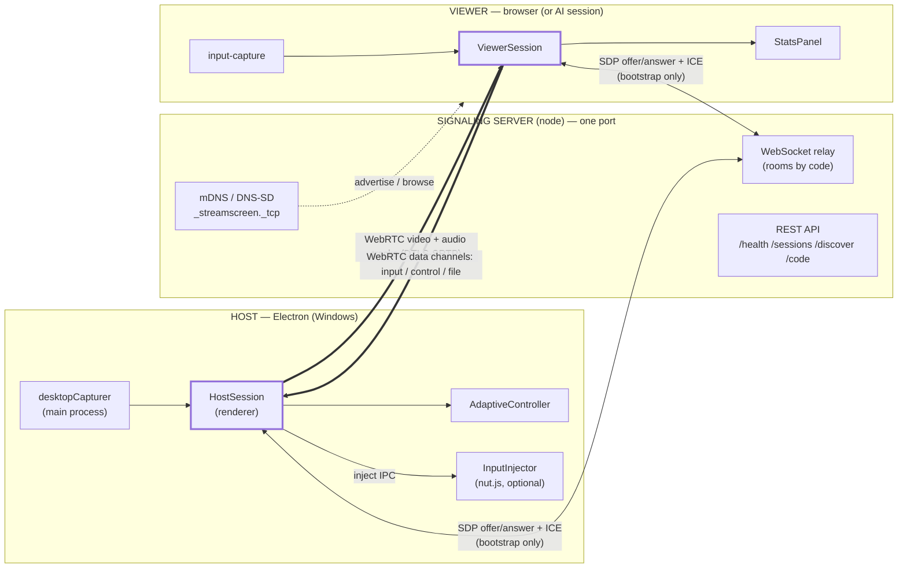
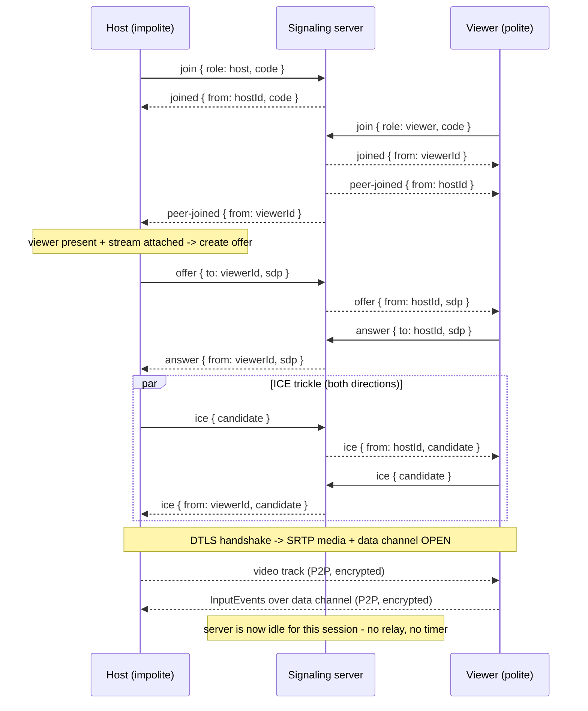
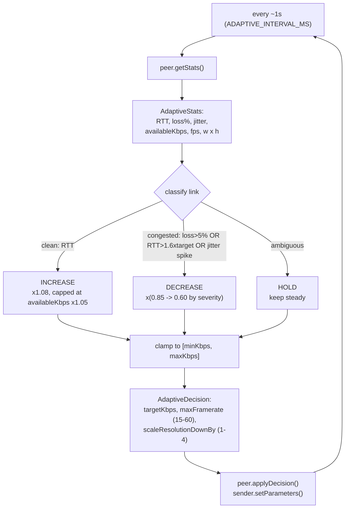
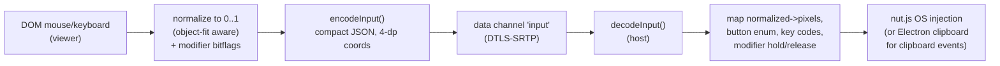
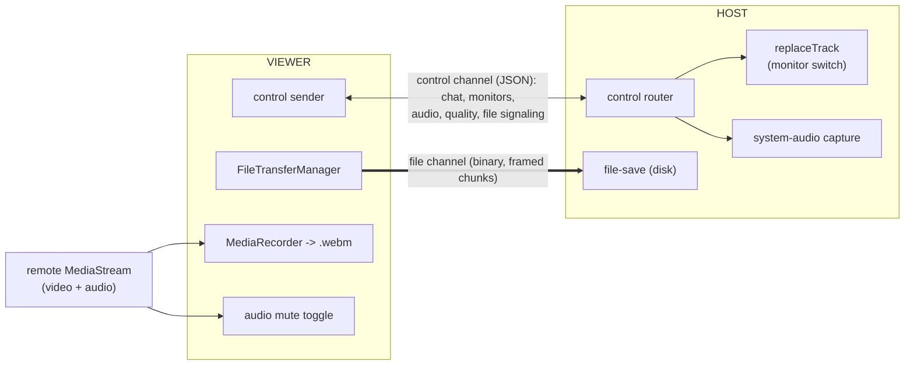
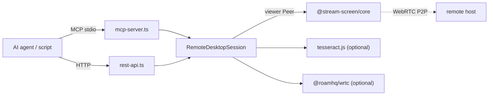

# StreamScreen Architecture

StreamScreen is a free, unlimited-time, LAN-first remote desktop for Windows.
Video and input flow **peer-to-peer over WebRTC**; a tiny signaling server only
helps the two peers find each other and exchange the WebRTC handshake. This
document covers the component model, the signaling/SDP/ICE flow, the adaptive
control loop, the input pipeline, and the security model — and states explicitly
that **there are no time limits or usage caps anywhere in the system.**

- [Components](#components)
- [Component diagram](#component-diagram)
- [Signaling / SDP / ICE flow](#signaling--sdp--ice-flow)
- [LAN discovery (mDNS)](#lan-discovery-mdns)
- [The adaptive control loop](#the-adaptive-control-loop)
- [The input pipeline](#the-input-pipeline)
- [Session features over the control & file channels](#session-features-over-the-control--file-channels)
- [AI control layer (MCP + REST)](#ai-control-layer-mcp--rest)
- [Security model](#security-model)
- [No-limits guarantee](#no-limits-guarantee)

---

## Components

An npm-workspaces TypeScript monorepo. Everything is built on the shared contract
in `@stream-screen/core`, which is intentionally dependency-light so the same code
runs identically in a browser and in node.

| Package | Runtime | Role |
|---|---|---|
| `@stream-screen/core` | browser + node | Protocol types + runtime building blocks: `Peer` (WebRTC), `SignalingClient`, `AdaptiveController`, input codec. |
| `@stream-screen/signaling` | node | Zero-config LAN server: WebSocket SDP/ICE relay + rooms, mDNS discovery, tiny REST API. |
| `@stream-screen/host` | Electron (Windows) | Captures screen + system audio, enumerates/switches monitors, runs the adaptive loop, injects remote input incl. special combos (`nut.js`), saves received files, tray UI. |
| `@stream-screen/viewer` | browser (Vite + React) | Renders the remote screen+audio, captures input, file transfer, monitor switching, recording, chat, live stats dashboard. |
| `@stream-screen/ai` | node | MCP (stdio) server + mirrored REST API so AI agents can drive a session (incl. monitors, chat, quality, key combos). |
| `@stream-screen/e2e` | node + Chromium | Playwright: two real browser peers run a live WebRTC session (12 specs: session/input/adaptive/audio/file (both directions)/control/keys/recording). |

---

## Component diagram



The thick `==>` arrows are the **peer-to-peer** WebRTC media/data paths. They are
direct between host and viewer and never traverse the signaling server. The thin
`<-->` arrows are the bootstrap-only signaling exchange.

If your Markdown renderer does not support Mermaid, here is the same topology in
ASCII:

```
   HOST (Electron, Windows)            SIGNALING (node, one port)         VIEWER (browser / AI)
   ─────────────────────────          ──────────────────────────         ─────────────────────
   desktopCapturer ─┐                  WebSocket relay (rooms)            ViewerSession ─► StatsPanel
                    ▼                   REST /health /sessions             ▲
            HostSession ──► Adaptive        /discover /code                │
                    │       Controller     mDNS _streamscreen._tcp     input-capture
       inject IPC   ▼                  ──────────────────────────
            InputInjector(nut.js)
                    ▲                          ▲          ▲
                    │   SDP/ICE (bootstrap)    │          │   SDP/ICE (bootstrap)
                    └──────────────────────────┘          └──────────────────────┐
                                                                                  │
   HOST ===== WebRTC video track (DTLS-SRTP, P2P) ============================►  VIEWER
   HOST ◄==== WebRTC data channel: InputEvents (DTLS-SRTP, P2P) ===============  VIEWER
                       (P2P paths NEVER traverse the signaling server)
```

---

## Signaling / SDP / ICE flow

Signaling exists **only** to set up the WebRTC connection. The server groups
peers into a *room* keyed by the 6–9 digit session code, relays SDP and ICE, and
emits lifecycle events. It carries **no media and no input** — once the peer
connection is established, application traffic is fully peer-to-peer.

Negotiation uses the WebRTC **perfect-negotiation** pattern (`core/peer.ts`):
the **host is impolite** (wins glare, offers first); the **viewer is polite**
(rolls back on collision).



Key points:

- **Rooms by code.** A host without a code mints one; viewers must target an
  existing room (`no-such-session` otherwise). One host + N viewers per room.
- **The server overwrites `from`** with the sender's authoritative id, so peers
  can't spoof each other within a room. `to` targets a specific peer; otherwise a
  message broadcasts to the rest of the room.
- **Auto-reconnect.** `SignalingClient` reconnects with exponential backoff
  (250 ms -> 8 s) and replays the last `join`, so a dropped Wi‑Fi signaling socket
  transparently rejoins. This is reconnection, **not** a session timer.
- **Keepalive != timeout.** A WebSocket ping/pong heartbeat reaps *dead* sockets
  (crashed peer, dropped Wi‑Fi) so `peer-left` fires promptly. It never ends a
  *healthy* session. See [No-limits guarantee](#no-limits-guarantee).

---

## LAN discovery (mDNS)

The signaling server advertises a `_streamscreen._tcp` service over mDNS/DNS-SD
(Bonjour/Avahi) carrying the host name, signaling port, and the session code in
TXT records. **Discovery is truthful: it advertises the codes of ACTUAL live host
rooms, never a placeholder minted at startup with no host behind it.** The server
re-syncs the advertised set from `SignalingServer.listSessions()` whenever a host
joins (room becomes live ⇒ publish that code) or leaves (room reaped ⇒ withdraw
it), via a `sessions-changed` event. `listSessions()` only counts rooms with a
currently-live host, and when a host disconnects its room is reaped immediately
(any lingering viewers get `host-disconnected` and are dropped) — so a hostless
room never lingers to feed a dead code to discovery or `/api/sessions`. Multiple
concurrent hosts each get their own
advertisement, and only valid 6–9 digit codes are published. The Electron host
makes this work end-to-end: it connects to the signaling server (LAN-local by
default) and joins a room with a stable code (`STREAMSCREEN_CODE` or generated),
so its session goes live and its code is advertised. Net effect: every discovered
code maps to a joinable live host room. Any machine on the same LAN can browse for
these and present a one-tap list — **zero configuration, no cloud, no accounts.**
If a host ever advertises an empty/invalid code (e.g. an mDNS race before it is
ready), the viewer prefills the field and waits for confirmation instead of
auto-connecting with a bad code.

mDNS is **best-effort and fully guarded**: on locked-down networks or sandboxes
where UDP multicast is blocked, advertise/browse degrade to graceful no-ops
(`available = false`) instead of crashing. Manual code entry always works without
discovery. Viewers reach discovery via `GET /api/discover`.

---

## The adaptive control loop

The "auto-negotiate lag" engine (`core/adaptive.ts`, driven by
`host/host-session.ts`) keeps the stream realtime on a busy network. It is a
deterministic **AIMD** (additive-increase / multiplicative-decrease) congestion
controller — no timers, no randomness, so it is directly unit-testable.



- **Inputs** come from the WebRTC stats API: candidate-pair RTT and
  `availableOutgoingBitrate`; inbound/outbound and remote-inbound RTP for
  loss, jitter, fps, and frame size.
- **Outputs** are applied to the outbound video sender's first encoding:
  `maxBitrate`, `maxFramerate`, `scaleResolutionDownBy`. Low-bandwidth links shed
  framerate first, then resolution — degrading gracefully instead of stalling.
- **No hard ceiling** other than the caller-supplied `maxKbps` (default 40 Mbps);
  the controller never imposes a time-based throttle. The viewer additionally
  surfaces Auto/High/Balanced/Low presets (`viewer/src/quality.ts`).

---

## The input pipeline

Remote control flows viewer -> host over a reliable, ordered WebRTC **data
channel** (label `input`), separate from the media track.



- **Resolution independence.** Pointer coordinates are normalized fractions in
  `[0,1]` of the remote screen, so they work regardless of either side's
  resolution. The host maps them to pixels against the live screen size
  (`normalizedToPixels`).
- **Events.** `m-move`, `m-down`, `m-up`, `m-wheel`, `k-down`, `k-up`,
  `clipboard`. Buttons: 0=left, 1=middle, 2=right. Modifier bitflags: 1=shift,
  2=ctrl, 4=alt, 8=meta.
- **Special key combos.** `buildKeyCombo` / `SPECIAL_KEYS` (`core/src/protocol.ts`)
  turn a logical chord (e.g. `['ctrl','alt','delete']`) into an ordered
  key-down/up sequence carrying the cumulative modifier bitmask, so chords the
  browser would intercept — **Ctrl+Alt+Del**, Win, Alt+Tab, Win+R, Win+D, Alt+F4,
  Esc — replay correctly on the host injector. These pure builders are
  unit-tested without the native library.
- **Wire codec** (`core/input-codec.ts`) is compact JSON with coordinates rounded
  to 4 decimals (sub-pixel on 4K) to keep pointer-move spam small; it is pure and
  round-trip safe, with an exhaustiveness guard so a new event variant fails to
  compile until handled.
- **Key translation.** DOM `KeyboardEvent.code` (e.g. `KeyA`, `Digit1`,
  `ArrowLeft`, `F5`) maps to nut.js `Key` enum names; modifiers are held/released
  around the main key. The pure mapping is unit-tested without the native library.
- **Graceful degradation.** The native injector (`@nut-tree-fork/nut-js`) is an
  **optional** dependency loaded lazily. If absent, input becomes a logged no-op
  and streaming continues. Clipboard events are handled by the Electron clipboard
  in the main process rather than synthetic keystrokes.

---

## Session features over the control & file channels

Collaboration features beyond raw screen+input ride two additional WebRTC data
channels next to the video/audio media — both reliable and ordered, both fully
peer-to-peer (they never traverse the signaling server):

- a text `control` channel carrying JSON `ControlMessage`s, and
- a binary `file` channel carrying raw file bytes.

The `ControlMessage` union (`core/src/protocol.ts`) is a single discriminated
type with a strict runtime guard (`isControlMessage`) that validates each
variant's required fields, so a malformed frame is rejected rather than partially
trusted. Its variants:

| Variant(s) | Purpose |
|---|---|
| `chat` | timestamped text chat, either direction |
| `request-monitors`, `monitors`, `switch-monitor`, `monitor-switched` | multi-monitor enumeration + runtime switch |
| `file-offer`, `file-accept`, `file-reject`, `file-progress`, `file-complete`, `file-error` | file-transfer signaling for the binary `file` channel |
| `audio` | toggle host system-audio capture on/off |
| `quality` | select an `auto`/`high`/`balanced`/`low` preset |



- **System audio.** The host mixes desktop audio into the captured stream and
  negotiates it as an audio track on the *same* peer connection (no second
  connection). The viewer plays it inline; mute/unmute flips the inbound track's
  `enabled` flag, and an `audio` control message asks the host to start/stop
  capture.
- **Multi-monitor switching.** The host advertises its displays as `MonitorInfo`
  (`id, name, primary, width, height`). The viewer requests the list, picks a
  display, and the host swaps the outbound video track **in place**
  (`replaceTrack`) — no SDP renegotiation, no session teardown — then acks
  `monitor-switched`. Only the *previous* tracks are stopped; the newly swapped-in
  track is kept live, so the viewer sees the new monitor instead of a frozen
  frame.
- **File transfer.** `FileTransferManager` (`core/src/file-transfer.ts`) is a
  pure, DOM-free chunker/reassembler. The sender emits `file-offer`, awaits
  `file-accept`, streams 16 KiB chunks over the binary `file` channel, then
  `file-complete`. Each chunk carries its **own transfer id** (a uint16
  length-prefixed id ahead of the `seq`+`payloadLen` header), so several
  concurrent transfers can share the single binary channel: the receiver routes
  every frame to its transfer by id, which keeps overlapping transfers (the
  viewer picker allows selecting multiple files) from corrupting one another. The
  receiver reassembles deterministically (the seq lets it slot out-of-order
  frames and detect gaps/duplicates) and reports `file-progress`; the Windows host
  persists received files via `host/src/file-save.ts`.
- **Recording.** Purely viewer-side and local: a `MediaRecorder` over the
  incoming remote `MediaStream` yields a downloadable `.webm`. Nothing is uploaded
  and there is no length cap.
- **Chat & quality.** Chat is timestamped text either direction; `quality` lets a
  viewer (or AI agent) pin a preset that the host actually honors: a
  `{t:'quality',preset}` control message re-bounds the `AdaptiveController` to the
  preset's `maxKbps` ceiling (`high`/`balanced`/`low` step it progressively down),
  so the AIMD loop can never ramp the stream above the chosen ceiling. `auto`
  restores the full adaptive range. This only uses the public controller bounds —
  nothing in `@stream-screen/core` changes, and there is no timer or usage cap.

None of these features introduce a timer, a usage counter, or a cap — they obey
the [No-limits guarantee](#no-limits-guarantee) like the rest of the system.

---

## AI control layer (MCP + REST)

`@stream-screen/ai` lets an AI agent (or any automation) drive a session as a
*viewer*. One shared tool registry (`tools.ts`) generates **both** an MCP stdio
server and a mirrored Express REST API, so the two transports can never diverge.



Tools: `list_hosts`, `connect`, `disconnect`, `screenshot`, `ocr_screen`,
`move_mouse`, `click`, `type_text`, `press_key`, `get_stats`, plus the
session-feature tools `list_monitors`, `switch_monitor`, `send_chat`,
`set_quality`, `send_keys` (arbitrary chord), and `press_combo` (named combos
incl. Ctrl+Alt+Del) — every one generated from the same `tools.ts` registry that
drives the MCP and REST surfaces, so they cannot drift. `list_hosts` is backed by
the signaling server's **REST API over HTTP** (`GET /api/discover`, falling back
to `/api/sessions`; the HTTP base is derived from the signaling WS URL or set via
`STREAMSCREEN_SIGNALING_HTTP_URL`), since the WS server has no `hosts` request —
so every code it returns maps to a live, joinable room. Returned codes are
validated against the 6–9 digit pattern and any unusable one is dropped; in
particular the `/api/sessions` fallback redacts codes (e.g. `****56`) for
unauthenticated callers, so `list_hosts` presents `STREAMSCREEN_TOKEN` as a bearer
token for un-redacted codes and drops any redacted code that `connect` would
reject. The node WebRTC
runtime and OCR engine are optional dynamic imports; when missing, the server and
its schemas stay valid and only the affected calls return a clear error.
Screenshots are produced by converting raw I420 frames to PNG with a
dependency-free encoder. **No call counts usage or expires a session.**

---

## Security model

StreamScreen is **LAN-first** and trades WAN reach for simplicity and privacy.

- **Transport encryption.** All WebRTC media and data are **DTLS-SRTP** encrypted
  end-to-end by the browser/Electron WebRTC stack. Even on the LAN, media and
  input are never sent in the clear.
- **No relay, no cloud.** Media and input flow directly peer-to-peer. The
  signaling server sees only SDP/ICE and room membership; it never sees pixels or
  keystrokes. There is no third-party server in the data path.
- **Session gating.** A session is gated by a **6–9 digit numeric code**. Viewers
  must target an existing room; unknown codes are rejected (`no-such-session`).
  Codes are minted with platform crypto where available.
- **Identity within a room.** The server assigns each peer an authoritative id
  and overwrites the `from` field on every relayed message, so peers in a room
  cannot impersonate one another during signaling.
- **Least privilege on the host.** The Electron host control window runs with
  `sandbox: true`, `contextIsolation`, no `nodeIntegration` in the renderer, a
  preload contextBridge for IPC, and a single-instance lock. OS input injection
  is an *optional* capability.
- **CORS.** The REST surfaces use permissive CORS deliberately, because they are
  intended to be reached from the LAN viewer/automation on other origins. Run the
  signaling and AI servers on trusted networks.
- **WS Origin policy.** The signaling WebSocket handshake checks the browser
  `Origin`. Non-browser clients (no Origin) and an explicit
  `STREAMSCREEN_ALLOWED_ORIGINS` allowlist (or `*`) are honored first; otherwise
  the default LAN/dev policy accepts Origins whose host is loopback, the same host
  as the server (any port — so the Vite dev viewer on `:5173` reaches signaling on
  `:8787`), or a private/link-local LAN address, and rejects foreign public
  origins. This keeps the zero-config and documented dev-viewer flows working
  without configuration while blocking cross-site public pages.
- **Threat model & limits.** The code gates *access*, but a short numeric code is
  not a substitute for network-level isolation on hostile networks. There is no
  built-in authentication beyond the code and no audit log. For untrusted
  networks, place StreamScreen behind a VPN/firewall (WAN/VPN traversal is on the
  roadmap; STUN/TURN hooks already exist in `Peer`).

---

## No-limits guarantee

This is load-bearing for StreamScreen's "always free, unlimited time" promise and
is enforced in code, not just by default config:

- **No session timer.** Nowhere in the signaling server, host, viewer, or AI
  layer is there a timer that ends or throttles a *healthy* session. A session
  lives exactly as long as its sockets stay open. (Contrast: AnyDesk's free tier
  ~15‑minute cutoff.)
- **The only timers are safety mechanisms, not limits.** The signaling
  heartbeat reaps *dead* sockets; the adaptive loop samples stats every ~1 s;
  `SignalingClient` backoff reconnects. None of these end a live session.
- **No usage metering or licensing.** No counters, no "commercial use" checks, no
  watermarks, no viewer caps imposed by policy.
- **No bitrate cap.** The only ceiling is the caller-supplied `maxKbps` (default
  40 Mbps) and what the physical link sustains — the adaptive engine raises
  quality whenever the link allows.
- **Rooms disappear only when the host leaves or the room empties.** A room is
  reaped once the host disconnects (it is no longer joinable) or the last socket
  leaves — this is cleanup, not a timeout.
- **Every feature is unmetered.** Audio, file transfer, multi-monitor switching,
  session recording, chat, and special key combos all run for the full life of
  the session with no per-feature timer, byte counter, or paywall — unlike
  AnyDesk, which gates file transfer/recording behind paid tiers and the
  ~15-minute free cutoff.

These invariants are documented at their enforcement points in
`signaling/src/server.ts`, `host/src/host-session.ts`, `core/src/adaptive.ts`,
and `ai/src/session.ts`.
</content>
